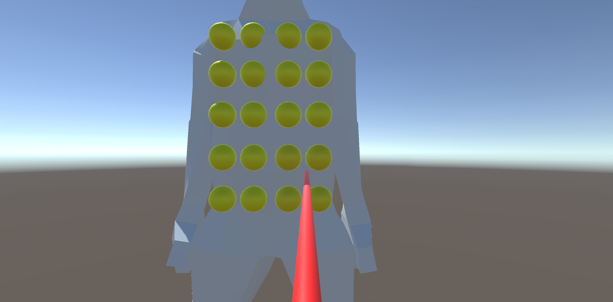
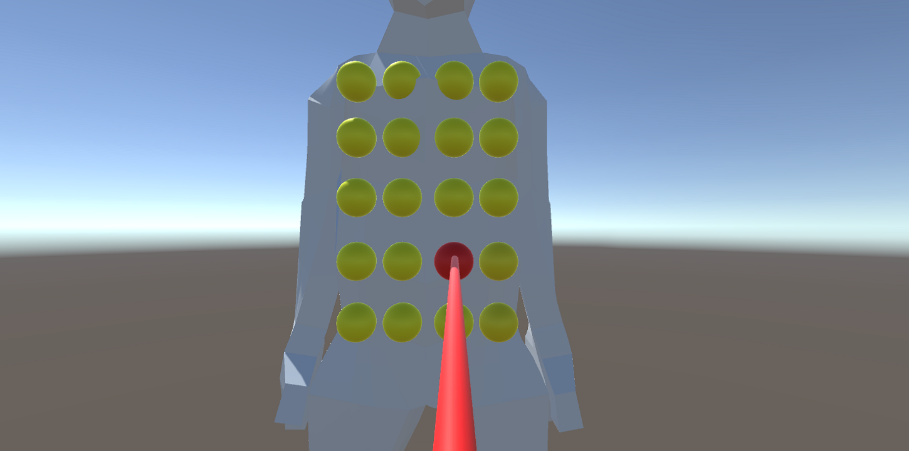

# Detailed-Haptic-Feedback-Vest

## Getting Started
- This project needs [TactSuit X40](https://www.bhaptics.com/tactsuit/tactsuit-x40) and [bHaptics Player](https://www.bhaptics.com/support/download).
- [Unity](https://unity3d.com/get-unity/download) is also required. `Unity 2020.3.14f1` is recommended.

## Input
- `W`, `A`, `S`, `D` : Move up and down, left and right.
- `Q`, `E` : Rotate.
- `F`, `R` : Move back and forth.

## Description

- Yellow spheres on the avatar represent 40 haptic feedback points in corresponding location.

- When you point some of them using a red stick that you control, it turns red. Then corresponding haptic feedback is given.
